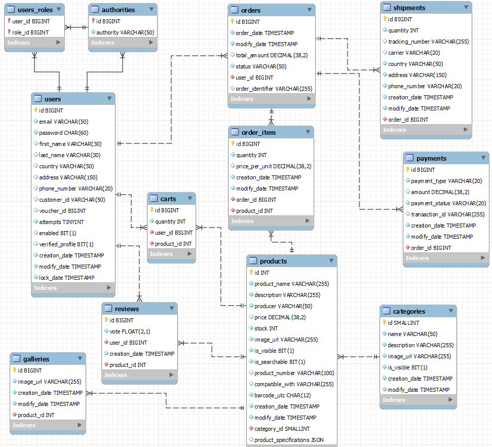

# Computer Store - Spring Fullstack Demo Project

### License: [Apache 2.0](LICENSE)

## Description

<b>Computer Store</b> is a cutting-edge e-commerce platform built using Java Spring framework, hosted on the reliable AWS (Amazon Web Services) cloud platform and integrated with Stripe payments. Designed to cater to tech-savvy consumers, this demo project showcases a seamless online shopping experience for computer hardware and accessories enthusiasts.

## Software Stack

<p><b>Software architecture:</b> Layered (n-tier) architecture using the MVC design pattern in the presentation layer</p>
<p><b>Software tools:</b> Java 21 (mandatory for Virtual Threads), Spring (Web MVC, JPA, Validation, Actuator, Data REST, Security, Caching, Aspect Oriented Programming (AOP), Thymeleaf, Lombok, Flyway, JavaScript, Bulma (Boostrap competitor), Swiper.js, Viewer.js, Chart.js, Zipkin, Stripe API, Stripe CLI, Maven</p>
<p><b>Database:</b> MySQL</p>
<p><b>Payment provider:</b> Stripe</p>
<p><b>Cloud Platform:</b> AWS Elastic Beanstalk</p>

### Key Features:
<ol>
    <li><b>User Authentication and Authorization:</b> Users can register, log in, and manage their profiles securely. Role-based access control ensures appropriate access levels for both customers and administrators.</li>
    <li><b>Product Catalog:</b> Explore a vast array of computer products conveniently categorized for easy navigation. From CPUs to graphic cards, peripherals to software, Computer Store offers an extensive selection to meet diverse needs.</li>
    <li><b>Search Functionality:</b> Find desired products quickly with the powerful search functionality. Users can search by product name, category, brand, or specifications to locate exactly what they're looking for.</li>
    <li><b>Product Details:</b> Detailed product pages provide comprehensive information about each item, including specifications, images, customer reviews, and related products, aiding informed purchasing decisions.</li>
    <li><b>Add to Cart:</b> Seamlessly add products to the shopping cart with just a click. Users can easily adjust quantities and remove items as needed before proceeding to checkout.</li>
    <li><b>Shopping Cart Management:</b> The shopping cart keeps track of selected items throughout the browsing session. Users can review their selections, update quantities, and proceed to checkout when ready.</li>
    <li><b>Checkout Process:</b> Streamlined checkout process ensures a hassle-free transaction experience. Users can enter shipping and billing information, select preferred payment methods, and review their order summary before confirming the purchase.</li>
    <li><b>Payment Gateway Integration:</b> Secure payment processing is facilitated through integration with popular payment gateways, ensuring confidentiality and reliability of transactions. Multiple payment methods, including credit/debit cards and digital wallets, are supported.</li>
    <li><b>Order Management:</b> Users can view order history, track the status of their orders, and receive notifications at each stage of the fulfillment process. Administrators have access to comprehensive order management tools for efficient processing and tracking.</li>
    <li><b>Responsive Design:</b> Computer Store is built with a responsive design, ensuring optimal performance and user experience across various devices and screen sizes, including desktops, laptops, tablets, and smartphones.</li>
    <li><b>Management Panel:</b> Managers have access to a robust management panel for managing products, categories, users, orders, and other aspects of the platform.</li>
    <li><b>Administration Panel:</b> Administrators have access to a robust admin panel for managing users and their details. Advanced analytics and reporting tools enable data-driven decision-making and performance monitoring.</li>
</ol>

### Additional Security Features

<ul>
    <li>Brute force protection for Login form (Locks account after three failed logins).</li>
    <li>Bot detection for automation tools like Postman (prod build).</li>
    <li>Added Content Security Policy (CSP) protection by adding specific response header.</li>
    <li>Enabled XSS protection.</li>
</ul>

## Setup the project

1. Install Java 21 LTS (OpenJDK Corretto)
2. Connect to your MySQL DB or use Docker to run it locally via script:

```bash
TEST_DB_NAME=name TEST_DB_PASSWORD=pass docker compose up
```

3. Connect to Stripe via api key (The demo uses test key for all environments)
4. Select profile from `application.properties` (test/benc/prod profile)
5. Optional: Add Database url, user and pass as VM options to prod profile: ` --DB_URL=url --DB_NAME=user --DB_PASSWORD=pass --STRIPE_SECRET_KEY=key --STRIPE_WEBHOOK_SECRET=secret`
6. Test the project in your favorite IDE
7. Use prod profile in the application.properties: `spring.profiles.active=prod`
8. Create execution jar from the terminal by using:

```bash
mvn clean package -Pproduction
```

9. Test the jar on locale environment from `./target` directory

```bash
java -jar computerstore-1.0.0-SNAPSHOT.jar --DB_URL=url --DB_NAME=user --DB_PASSWORD=pass --STRIPE_SECRET_KEY=key --STRIPE_WEBHOOK_SECRET=secret
```

## Prepare the cloud platform

AWS Services: EC2, S3, VPC, Identity and Access Management (IAM), Optional(Elastic Load Balancing, Web Application Firewall, CloudWatch, Route 53, Certificate Manager)

1. Register and Login to AWS
2. Search for Elastic Beanstalk
3. Create new environment with support for Java
4. Disable DB services (We are using database outside from AWS cloud)
5. Disable Alarm service
6. Disable scheduled updates
7. Select `Single Instance` (use `Load Balancer` if you have registered domain in to `Route 53` and need to add SSL certificate)
8. Add role to the environment (Check how to create a new role below)
9. Configure: Processor type x86_64 and Instance types t3.nano (2 CPU and 512mgb RAM). This is recommended setup for this project.
10. Add new `Environment properties` (Path: Elastic Beanstalk > Environments > {Your env name} > Configuration > Environment properties) for values: DB_URL, DB_NAME, DB_PASSWORD, STRIPE_SECRET_KEY, STRIPE_WEBHOOK_SECRET
11. Upload the jar file when the environment is ready


## Create a new role for Elastic Beanstalk
<p><b>Path:</b> AWS Console > IAM > Roles > Create role</p>
<p><b>Add all three permissions:</b></p>
<ul>
    <li>AWSElasticBeanstalkWebTier</li>
    <li>AWSElasticBeanstalkWorkerTier</li>
    <li>AWSElasticBeanstalkMulticontainerDocker</li>
</ul>

## Prepare the payment provider

1. Register and login to Stripe: https://stripe.com
2. Validate your account (no need to fill any payment information)
3. Copy your secret API key to the project (use key `STRIPE_SECRET_KEY` as environment variable)
4. Create a new webhook notification (Stripe > Developer > Webhook > Add listener to local profile)
5. Select current Stripe API version (Should be the same as your project)
6. Select events for notification `checkout.session.completed`
7. Copy Signing secret to your project (use key `STRIPE_WEBHOOK_SECRET` as environment variable)
8. Optionally, you could use https://webhook.site to test
9. Optionally, test locally via Stripe CLI.
- Download and add to system environment Stripe CLI
- Login via terminal

```bash
stripe login
```
- Listen to your local port

```bash
stripe listen --forward-to http://localhost:5000/Status/payment-complete
```

- Add the new generated webhook secret for the test
- Trigger event in new terminal: `checkout.session.completed`

```bash
stripe trigger checkout.session.completed
```

- Override the test data
- Use real customer_id from stripe
- Use `\\` for a new line
- Use `--override` to set a new parameter's value, format: `RESOURCE:PROPERTY=VALUE`
- Use `--add` to add a new parameter, format: `RESOURCE:PROPERTY=VALUE`
- Docs: https://docs.stripe.com/stripe-cli/triggers

```bash
stripe trigger checkout.session.completed \
  --override checkout_session:customer="cus_ALABALA" \
  --override checkout_session:client_reference_id="123"
```

## Override the default GC (Optional)

> [!NOTE]  
> ZGC and Generational ZGC are used for low latency application. Choice what works for you better.

<p><b>Path:</b> Elastic Beanstalk > Environments > {Your env name} > Configuration</p>

1. Find `Updates, monitoring, and logging` and click Edit button
2. Click `Add environment properties` at the bottom of the view
3. Fill the Name and Value with correct data


<b>Name:</b> `JVM Options`

<b>Value:</b> for regular ZGC use `-XX:+UseZGC`

<p>OR</p>

<b>Value:</b> for Generational ZGC use `-XX:+UseZGC -XX:+ZGenerational`

Optionally you could add RAM limit with value: `-XX:MaxRAMPercentage=80.0`

## Environment Information

### Dependencies profiles

1. development: default profile, use with the following command

```bash
mvn clean package 
```

2. production: optimized profile for production, use with the following command

```bash
mvn clean package -Pproduction 
```

### Spring Environment profiles

1. `test`: setup with: logging, AOP, disable cache, no tracing
2. `benc`: setup with: logging, AOP, active tracing
3. `prod`: setup with: no logging, no tracing, optimizations for production

### Test Users

1. Role: `customer`; <br>Username: <i>abv@abv.bg</i><br>Password: <i>test</i>
2. Role: `customer`, `manager`; <br>Username: <i>manager@abv.bg</i><br>Password: <i>test</i>
3. Role: `customer`, `manager`, `admin`; <br>Username: <i>admin@abv.bg</i><br>Password: <i>test</i>
4. Role: `manager`; <br>Username: <i>manager@gmail.com</i><br>Password: <i>test</i>
5. Role: `admin`; <br>Username: <i>admin@gmail.com</i><br>Password: <i>test</i>

### Custom Timer Events

1. Initialize order shipping: trigger every 12 hours
2. Shipping delivery: trigger every 6 hours
3. Order complete: trigger every day at midnight (only if the order has been fulfilled and at least 14 days have passed)
4. Clean up non consumed orders: trigger every 8 hours

### API testing

> [!IMPORTANT]
> Use only for `test` profile! Be sure CSRF is disabled!

<p>Postman collection: <a href="https://github.com/balantaim/spring-computerstore/blob/master/postman/computer-store.postman_collection.json">postman.json</a></p>

### Tracing and Latency testing

> [!IMPORTANT]
> Use only for `benc` profile!

1. Download Zipkin jar

```bash
curl -sSL https://zipkin.io/quickstart.sh | bash -s 
```

2. Execute the following bash script from the jar's folder in new terminal window

```bash
java -jar zipkin.jar
```

3. Navigate browser to http://localhost:9411/

### Actuator endpoint

<p>Actuator link: <a href="http://computer-store.eu-north-1.elasticbeanstalk.com/page/actuator">/page/actuator</a></p>

## Project optimisations

1. Gzip conversion
2. Enable cacheable static assets: `*.js, *.css, image/**`
3. Enable data caching with Spring: products


### Limitations

<ul>
    <li><b>Email Sender</b> is not implemented for this project! New user profiles are verified by default. Alternatively, you can use Amazon SES. Check how to implement Email Sender: <a href="https://github.com/balantaim/EmailSender">EmailSenderRepository</a></li>
</ul>

## Useful tools

<ul>
    <li>Postman - REST user interface tool URL: <a href="https://www.postman.com/downloads/">Postman</a></li>
    <li>MySQL Workbench - user interface tool URL: <a href="https://dev.mysql.com/downloads/workbench">MySQL Workbench</a></li>
    <li>DBeaver - multiple DB user interface tool URL: <a href="https://dbeaver.io/download">DBever - Universal Database Tool</a></li>
</ul>

## Production Website

You could check the latest changes online on the production link below.

AWS Elastic Beanstalk production link: <a href="http://computer-store.eu-north-1.elasticbeanstalk.com">computer-store.eu-north-1.elasticbeanstalk.com</a>

## Gallery




### Analytics

- [ ] Google Analytics + Enhanced Ecommerce
- [ ] Facebook Pixel
- [ ] Facebook Catalog Dynamic Ads
- [ ] Google Ads Conversion Tracking
- [ ] Google Tag Manager & Google Optimize

### File Structure

```bash
tree -d -A
```

```tree
├── main
│   ├── java
│   │   └── com
│   │       └── martinatanasov
│   │           └── computerstore
│   │               ├── aspect
│   │               ├── boostrap
│   │               ├── config
│   │               ├── controllers
│   │               ├── entities
│   │               ├── model
│   │               ├── repositories
│   │               ├── security
│   │               │   ├── filters
│   │               │   └── login
│   │               ├── services
│   │               │   └── payments
│   │               ├── shedulers
│   │               └── utils
│   │                   └── converter
│   └── resources
│       ├── db
│       │   └── migration
│       ├── lang
│       ├── static
│       │   ├── css
│       │   ├── images
│       │   │   ├── carriers
│       │   │   ├── category
│       │   │   └── home
│       │   ├── js
│       │   └── other
│       └── templates
│           ├── About
│           ├── Administration
│           ├── Cart
│           ├── Checkout
│           ├── error
│           ├── fragments
│           ├── Home
│           ├── Login
│           ├── Management
│           ├── Orders
│           ├── Products
│           ├── Register
│           └── UserProfile
└── test
    └── java
        └── com
            └── martinatanasov
                └── computerstore
                    ├── controllers
                    └── repositories
```
